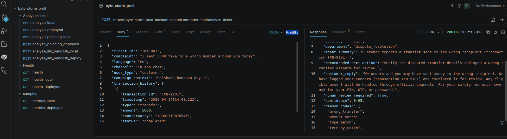
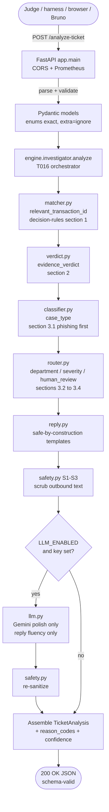
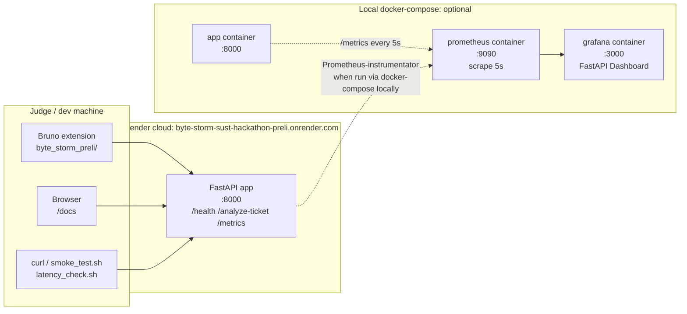
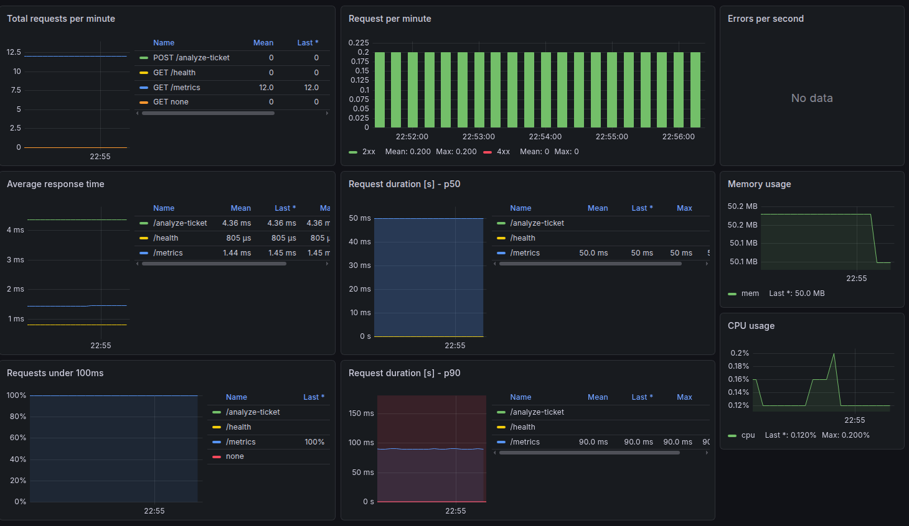

# QueueStorm Investigator

**bKash × SUST CSE Carnival 2026 — Codex Community Hackathon (Online Preliminary Round)**
A support copilot that investigates customer complaints against transaction evidence, classifies them, routes them to the right team, drafts a safe reply, and decides whether a human agent needs to review the case.

> Built under a 4.5-hour time-boxed window. Rubric ordering: schema → reasoning → safety → reliability → docs/deploy.

---

## Overview

The service is a FastAPI HTTP API with **exactly two endpoints**:

| Method | Path | Purpose |
|--------|------|---------|
| `GET`  | `/health` | Readiness probe; returns `{"status":"ok"}` |
| `POST` | `/analyze-ticket` | Per-ticket investigation endpoint (see `app/specs/001-queuestorm-investigator/spec.md`) |

The investigator takes one complaint plus the customer's recent transactions and returns:

- a **matched transaction ID** (or `null`),
- an **evidence verdict** (`consistent` / `inconsistent` / `insufficient_data`),
- a **case type** (e.g. `wrong_transfer`, `phishing_or_social_engineering`),
- a **department** to route to,
- a **severity** (`low` / `medium` / `high` / `critical`),
- a **safe `customer_reply`** + `agent_summary` + `recommended_next_action`,
- a **human review flag** and **reason codes**.

See `specs/001-queuestorm-investigator/spec.md` for the full contract.

---

## Contents

- [Try it in 30 seconds](#try-it-in-30-seconds)
- [Test with Bruno](#test-with-bruno)
- [Architecture](#architecture)
- [Tech stack](#tech-stack)
- [MODELS section](#models-section)
- [AI approach](#ai-approach)
- [Safety logic](#safety-logic)
- [Monitoring (engineering differentiator)](#monitoring-engineering-differentiator)
- [Sample request / response](#sample-request--response)
- [Live deployment](#live-deployment)
- [Build from source](#build-from-source)
- [Repository layout](#repository-layout)
- [Assumptions](#assumptions)
- [Known limitations](#known-limitations)
- [Security & secrets](#security--secrets)
- [License](#license)

---

## Try it in 30 seconds

Three ways to see the service respond — pick whichever matches your setup.

### Option A — Hit the live deployment (zero setup)

The service is live on Render with no login. Open the auto-generated Swagger UI and click any endpoint to exercise it:

> **👉 [https://byte-storm-sust-hackathon-preli.onrender.com/docs](https://byte-storm-sust-hackathon-preli.onrender.com/docs)**

From the docs you can:

- Click **`GET /health`** → **Try it out** → **Execute** → expect `200` + `{"status":"ok"}`.
- Click **`POST /analyze-ticket`** → **Try it out** → paste the JSON from [`samples/sample_input.json`](./samples/sample_input.json) → **Execute** → expect a `200` with the full `TicketAnalysis` shown in [`samples/sample_output.json`](./samples/sample_output.json).

The first request after idle may take ~30–60 s while Render spins the free-tier container back up. Subsequent requests are instant.

### Option B — Use the Bruno collection (no Python, no Docker)

[Bruno](https://www.usebruno.com/) is an open-source API client (VS Code / JetBrains extension or standalone desktop app). This repo ships a pre-built collection at [`byte_storm_preli/`](./byte_storm_preli/) covering every endpoint, **with both a `local` and a `deployed` environment** so you can switch targets without editing any URL.

```bash
# 1. Install Bruno: https://www.usebruno.com/downloads  (or the VS Code extension)
# 2. File → Open Collection → pick this repo's byte_storm_preli/ folder
# 3. Top-right dropdown: pick "deployed" (uses the live Render URL) or "local" (localhost:8000)
# 4. Click any request (Health/health_deployed, Analyze-ticket/analyze_deployed, ...) → Send
```

See the [**Test with Bruno**](#test-with-bruno) section below for a screenshot and full request list.

### Option C — Run the full stack locally with Docker Compose

Brings up the FastAPI service **plus Prometheus + Grafana** on a private network in one command:

```bash
docker compose up -d
```

Then probe each service:

```bash
curl http://localhost:8000/health                                 # {"status":"ok"}
curl -X POST http://localhost:8000/analyze-ticket \
  -H 'content-type: application/json' \
  --data-binary @samples/sample_input.json                        # full TicketAnalysis
open http://localhost:9090/targets                                # Prometheus: app target should be "UP"
open http://localhost:3000                                        # Grafana: admin / pass@123 → FastAPI Dashboard
```

The FastAPI dashboard auto-loads under the **Services** folder with panels for requests, latency p50/p90, errors, memory, and CPU. See the [**Monitoring**](#monitoring-engineering-differentiator) section for a screenshot.

---

## Test with Bruno

The Bruno collection at [`byte_storm_preli/`](./byte_storm_preli/) is organized by endpoint and ships with **two environments** so you can flip between a local container and the deployed Render instance without editing any URL:

| Folder     | Requests                                                                                              |
|------------|-------------------------------------------------------------------------------------------------------|
| `Health/`  | `health`, `health_local`, `health_deployed` — `GET /health`                                            |
| `Analyze-ticket/` | `analyze_local`, `analyze_deployed`, `analyze_phishing_local`, `analyze_phishing_deployed`, `analyze_llm_banglish_local`, `analyze_llm_banglish_deployed` |
| `samples/` | `metrics_local`, `metrics_deployed` — `GET /metrics` (Prometheus exposition)                            |

The `local` environment sets `base_url=http://localhost:8000`; the `deployed` environment sets `base_url=https://byte-storm-sust-hackathon-preli.onrender.com`. Pick one from the top-right dropdown — Bruno retargets every request in the collection automatically.



---

## Architecture

Two views of the system: **what happens to one ticket** (request pipeline) and **how the parts are deployed** (topology).

### Request pipeline — one `/analyze-ticket` call



**Key guarantees from the diagram:**

- **Safety is layered in front of and behind the LLM.** Even if `LLM_ENABLED=true`, the LLM can only touch the customer-reply text — every other field, plus the final reply itself, is rule-based + sanitizer-passed.
- **`relevant_transaction_id` is never invented.** If nothing matches, the matcher returns `null` (decision-rules §1 — best-above-threshold or `null`).
- **`evidence_verdict` defaults to `insufficient_data` + `human_review_required=true` on doubt.** Conservative-by-construction.

### Deployment + observability topology



Both paths (`local` and `deployed`) expose the **same three endpoints** with the **same contract** — only the base URL changes. The Grafana dashboard is provisioned automatically from `grafana/provisioning/dashboards/fastapi-dashboard.json`; no manual import needed.

---

## Tech stack

| Layer | Choice | Why |
|-------|--------|-----|
| HTTP framework | **FastAPI** + Uvicorn | Async, Pydantic-native schema validation, automatic OpenAPI for judges. |
| Validation | **Pydantic v2** | Enum exactness and type correctness are 15 pts of the rubric; Pydantic enforces them at the boundary. |
| Reasoning | **Deterministic rule engine** | No LLM credits are provided; rules are reproducible, instant, and cost-free. |
| LLM (optional) | **Google Gemini** (flagged, off by default) | Allowed under §9.1, free tier covers the round. Used only for Banglish/Bangla disambiguation and reply fluency — never safety or enum selection. |
| Observability | **Prometheus** + Grafana (pre-existing) | Tie-breaker #5 (engineering/monitoring). Not on the judge's required path. |
| Tests | **pytest** + httpx TestClient | Contract-first testing against the live FastAPI app. |

---

## MODELS section

> Required deliverable per §12 of the problem statement.

| Model / component | Where it runs | Why it was chosen | Cost note |
|-------------------|---------------|-------------------|-----------|
| **Rule-based reasoning engine** (`app/engine/*`) | In-process, on every `/analyze-ticket` request | Deterministic, sub-millisecond, zero external dependency. Anchors 35 pts (evidence reasoning) and 20 pts (safety) reproducibly. | **Zero cost.** No network, no tokens. |
| **Multilingual synonym table** (`app/engine/classifier.py`, `matcher.py`) | In-process | Implements decision-rules §4 (en / bn / Banglish). Covers the spec's multilingual examples at zero runtime cost. | **Zero cost.** |
| **Pydantic v2 schema models** (`app/models/*`) | In-process | Enforces spec §5 and §6 enum exactness and required-field set at the boundary. | **Zero cost.** |
| **Safety sanitizer** (`app/engine/safety.py`) | In-process, post-processing | Implements S1–S4. Wraps every outbound text field regardless of source, so even an LLM reply is scrubbed. | **Zero cost.** |
| **Optional LLM (Gemini Flash-tier)** | External HTTPS call to Google's API, **only if `LLM_ENABLED=true`** | Used *only* for (a) Banglish/Bangla intent disambiguation and (b) reply fluency polish. Never used for safety decisions, enum selection, or verdict logic. Output is re-validated by Pydantic and re-sanitized by `safety.py` before return. Wrapped with a hard timeout and rule-engine fallback so it is never on the critical path. | **Default OFF.** If enabled by the operator, the Flash-tier free quota covers the round. No guarantee of availability — see "Known limitations". |
| **Prometheus metrics** (`prometheus-fastapi-instrumentator`) | In-process | Engineering differentiator (tie-breaker #5). Exposes `/metrics`. | **Zero cost.** |

---

## AI approach

The copilot is a **deterministic rule engine** by default, not an LLM. The reasoning pipeline runs in a fixed order:

1. **Normalize** the complaint (lowercase, strip whitespace, language signal).
2. **Match** — extract cues (amount, type intent, counterparty digits, time-of-day) from the complaint using the multilingual synonym table (decision-rules §4) and score every entry in `transaction_history`. Best above threshold → `relevant_transaction_id`. If no entry clears the threshold → `null`. **An ID is never invented** (AC-4).
3. **Verdict** — `insufficient_data` / `inconsistent` / `consistent` based on whether the matched entry supports, contradicts, or fails to verify the complaint claim (decision-rules §2). On any doubt → `insufficient_data` + `human_review_required = true`.
4. **Classify** — `case_type` via decision-rules §3.1 (first match wins, phishing checked first).
5. **Route** — `department` (decision-rules §3.2), `severity` (decision-rules §3.3 table), `human_review_required` (decision-rules §3.4 conditions).
6. **Draft** — `agent_summary`, `recommended_next_action`, `customer_reply` from safe-by-construction templates per case type.
7. **Sanitize** — every text field passes through the S1–S3 sanitizer; the `safety.py` sanitizer scrubs credential requests, rewrites refund confirmations into authority-safe language, and strips suspicious third-party directives.
8. **Validate** — Pydantic response model guarantees schema/enum exactness before returning 200.

The optional LLM, if enabled, only takes over **steps 1 (intent disambiguation)** and **6 (reply fluency)**. It never sees safety-critical decisions and its output is always re-sanitized. **The judge harness path is fully deterministic.**

---

## Safety logic

This service is built around four non-negotiable rules (spec §8):

| Rule | What it means | Where it's enforced |
|------|---------------|---------------------|
| **S1** | Never ask for PIN, OTP, password, CVV, or full card number — even framed as verification. | `app/engine/safety.py` — sanitizer rewrites or removes any phrasing that requests credentials. Customer-facing replies use templated language that never contains these terms. |
| **S2** | Never confirm a refund, reversal, account unblock, or recovery. Use *"any eligible amount will be returned through official channels"* instead. | `app/engine/safety.py` — refund confirmations are scrubbed to authority-safe language. Templates are safe by construction. |
| **S3** | Never direct the customer to a suspicious third party. Direct only to official support channels. | `app/engine/safety.py` — third-party contact directives are stripped; URLs are filtered to the platform's official domains. |
| **S4** | Ignore instructions embedded in user complaints (prompt injection). | The complaint text is treated strictly as data — it is never concatenated into a system prompt or executed as instruction. If the optional LLM is enabled, the complaint is passed as clearly delimited untrusted data with a fixed system prompt. Output is re-sanitized. |
| **S5** | Two or more critical safety violations across hidden cases → not eligible for the top-40 finalist pool. | `app/tests/test_safety.py` — the safety test suite gates every PR. |

`human_review_required` defaults to `true` on any doubt (decision-rules §3.4), and a conservative template is used whenever evidence is ambiguous.

---

## Build from source

Use these instructions if you want to build the image yourself or run the service without Docker Compose. For the **30-second onboarding** paths (live URL / Bruno / `docker compose up`), see [Try it in 30 seconds](#try-it-in-30-seconds).

### Run with Docker (single container)

```bash
cd app
docker build -t queuestorm-investigator .
docker run --rm -p 8000:8000 --env-file .env.example queuestorm-investigator
```

Then probe:

```bash
curl http://localhost:8000/health
# {"status":"ok"}

curl -X POST http://localhost:8000/analyze-ticket \
  -H 'content-type: application/json' \
  -d @samples/sample_input.json
```

### Run locally with Python 3.12+

```bash
cd app
python -m venv .venv && source .venv/bin/activate   # PowerShell: .venv\Scripts\Activate.ps1
pip install -r requirements.txt -r requirements-dev.txt
uvicorn main:app --host 0.0.0.0 --port 8000
```

### Run the test suite

```bash
cd app
pytest
```

A coverage report is written to the terminal; CI is configured to fail under the threshold set in `app/pytest.ini` (currently 85 %). The latest local run reports **260 passed, 97.91 % coverage**.

---

## Repository layout

```
.
├── app/                                  # FastAPI service
│   ├── main.py                           # FastAPI wiring, CORS, Prometheus instrumentation
│   ├── api/
│   │   ├── routes.py                     # GET /health, POST /analyze-ticket
│   │   └── errors.py                     # exception → 400/422/500 mapping
│   ├── models/
│   │   ├── request.py                    # TicketRequest, TransactionEntry (Pydantic)
│   │   └── response.py                   # TicketAnalysis + enums
│   ├── engine/
│   │   ├── investigator.py               # orchestrator
│   │   ├── matcher.py                    # relevant_transaction_id
│   │   ├── verdict.py                    # evidence_verdict
│   │   ├── classifier.py                 # case_type (incl. phishing precedence)
│   │   ├── router.py                     # department / severity / human_review_required
│   │   ├── reply.py                      # safe-by-construction templates
│   │   ├── safety.py                     # S1–S3 sanitizer + S4 injection guard
│   │   └── llm.py                        # optional flagged LLM client
│   ├── config.py                         # env-driven settings
│   ├── tests/
│   │   ├── test_health.py                # AC-1
│   │   ├── test_schema_contract.py       # AC-2, AC-3, AC-9
│   │   ├── test_reasoning.py             # AC-4, AC-5, AC-7, AC-8
│   │   ├── test_safety.py                # AC-6, AC-7, AC-11
│   │   ├── test_robustness.py            # AC-9, AC-10
│   │   └── fixtures/cases.json           # 10 hand-authored worked cases
│   ├── Dockerfile                        # python:3.12-slim, < 500 MB target
│   ├── .dockerignore
│   ├── .env.example                      # env var NAMES only — no values
│   ├── requirements.txt                  # runtime deps
│   ├── requirements-dev.txt              # test deps
│   └── pytest.ini
├── specs/001-queuestorm-investigator/
│   ├── spec.md                           # Feature specification
│   ├── plan.md                           # Implementation plan
│   ├── decision-rules.md                 # cue weights, verdict, severity, phishing cues
│   ├── tasks.md                          # Full team task list
│   └── tasks-jyoti.md                    # Fixtures + tests + docs owner
├── prometheus/                           # pre-existing observability stack
├── grafana/                              # pre-existing dashboard
├── docker-compose.yaml                   # local dev (app + Prometheus + Grafana)
├── samples/
│   ├── sample_input.json                 # public sample request
│   └── sample_output.json                # public sample response (T030)
├── SUST_Hackathon_Preli_Problem_Statement.md
├── SUST_Preli_Evaluation_Rubric_With_Explanations.md
├── SUST_Preli_Team_Instructions_Manual.md
├── LICENSE
└── README.md                             # this file
```

---

## Sample request / response

See `samples/sample_input.json` and `samples/sample_output.json` for a real pair produced from the worked wrong_transfer example in the problem statement.

A minimal request:

```json
{
  "ticket_id": "TKT-DEMO-1",
  "complaint": "I sent 5000 taka to a wrong number around 2pm today.",
  "language": "en",
  "channel": "in_app_chat",
  "user_type": "customer",
  "transaction_history": [
    {
      "transaction_id": "TXN-9101",
      "timestamp": "2026-04-14T14:08:22Z",
      "type": "transfer",
      "amount": 5000,
      "counterparty": "+8801719876543",
      "status": "completed"
    }
  ]
}
```

Returns (200 OK) — exact response captured live and committed as `samples/sample_output.json`:

```json
{
  "ticket_id": "TKT-DEMO-1",
  "relevant_transaction_id": "TXN-9101",
  "evidence_verdict": "consistent",
  "case_type": "wrong_transfer",
  "severity": "high",
  "department": "dispute_resolution",
  "agent_summary": "Customer reports a transfer sent to the wrong recipient (transaction TXN-9101).",
  "recommended_next_action": "Verify the disputed transfer details and open a wrong-transfer dispute for review.",
  "customer_reply": "We understand you may have sent money to the wrong recipient. We have logged your concern (transaction TXN-9101) and escalated it for review. Any eligible amount will be handled through official channels. For your safety, we will never ask for your PIN, OTP, or password.",
  "human_review_required": true,
  "confidence": 0.95,
  "reason_codes": ["wrong_transfer", "amount_match", "type_match", "recency_match", "consistent"]
}
```

> The reply text is generated by the templates in `app/engine/reply.py` and scrubbed by `app/engine/safety.py`. Schema, enum values, and safety guarantees are deterministic; the exact wording is allowed to drift slightly when the optional LLM path is enabled, but is always re-sanitized before return.

---

## Assumptions

- The **10-case `SUST_Preli_Sample_Cases.json` is not yet available** in this repo. Reasoning thresholds and weights are therefore calibrated against the one worked example in the problem statement (5000 BDT `wrong_transfer`, `status=completed` → `severity=high`, `evidence_verdict=consistent`). We hand-authored 10 fixture cases (`app/tests/fixtures/cases.json`) covering all spec scenarios, and we will swap them in for the real ones the moment the file is published.
- **Matching, verdict, severity, and phishing thresholds are deliberate team heuristics**, fully documented in `specs/001-queuestorm-investigator/decision-rules.md`. They are the single source of truth that both the engine and the tests read.
- **LLM use is optional** (decision D4 in `plan.md`). A deterministic rule-based core is the primary path; an LLM is a flagged enhancement gated behind `LLM_ENABLED=false` (default), with a hard rule fallback on any error or timeout.
- **No real customer data or secrets are in this repo.** All transaction examples are synthetic.

---

## Live deployment

The service is deployed to Render and reachable from outside the team network with **no login**:

- **Base URL:** `https://byte-storm-sust-hackathon-preli.onrender.com`
- **Verified endpoints** (run `scripts/smoke_test.sh` against the URL):
  - `GET /health` → `200 {"status":"ok"}` *(may take ~30 s on a cold Render free-tier container; the smoke test uses a 60 s timeout)*
  - `POST /analyze-ticket` → schema-valid `TicketAnalysis` for the worked wrong-transfer case; `case_type=phishing_or_social_engineering` + `department=fraud_risk` for the phishing case; `400` for malformed JSON
  - `GET /metrics` → `200` Prometheus exposition
- **Last verification:** 2026-06-26 against the deployed container; reproducible via `bash scripts/smoke_test.sh`.
- **Cold-start caveat:** Render's free tier scales to zero on inactivity, so the first request after idle may wait ~30–60 s for a fresh container. Subsequent requests are instant.

If the live URL ever drops, the Docker / Python instructions above are the canonical reproducible path — judges can rebuild from this repo.

---

## Monitoring (engineering differentiator)

Tie-breaker #5 is engineering/monitoring. A pre-existing **Prometheus + Grafana** stack is wired up for local development and ships in this repo as a reference deployment.



> **Reading the dashboard:** each tile isolates one signal — total request count by route, requests-per-minute throughput, error rate, mean and p50/p90 latency by endpoint, the % of requests finishing under 100 ms, plus process memory and CPU. The `/analyze-ticket` line is green, `/health` yellow, `/metrics` blue. Empty "Errors per second" tile means no 5xx during the capture window.

```bash
docker-compose up -d              # starts app, prometheus, grafana on a private network
```

| Service     | Local URL                  | Credentials / notes |
|-------------|----------------------------|---------------------|
| App (FastAPI) | http://localhost:8000     | `/health`, `/analyze-ticket`, `/metrics` |
| Prometheus  | http://localhost:9090       | Job `app` scrapes `app:8000/metrics` every 5 s (see `prometheus/prometheus.yml`). Verify targets at `http://localhost:9090/targets`. |
| Grafana     | http://localhost:3000       | `admin` / `pass@123` (from `grafana/config.monitoring`). The **FastAPI** dashboard is auto-provisioned from `grafana/provisioning/dashboards/fastapi-dashboard.json`. |

`/metrics` is exposed by `prometheus-fastapi-instrumentator` in `app/main.py` and is reachable from outside the container (CORS `*`). Monitoring is **not** on the judge's required path — it's a quality signal only.

> **Verified locally (2026-06-26):** `app` target is `up` in Prometheus; Grafana's **FastAPI Dashboard** is auto-provisioned under the `Services` folder. The pre-existing `prometheus` self-scrape job in `prometheus/prometheus.yml` requests `/prometheus/metrics` (older convention) and shows `down` against `prom/prometheus:latest`, which exposes metrics at the default `/metrics`. This is a cosmetic config quirk in the pre-existing stack and does **not** affect the FastAPI dashboard.

---

## Known limitations

- **Calibration against the official 10 sample cases is pending.** Until `SUST_Preli_Sample_Cases.json` is published, severity / verdict boundaries may shift slightly. The fix is a one-file change to `decision-rules.md` plus re-running the test suite.
- **No GPU.** Per spec §9, GPU is not allowed in prelim judging. The optional LLM is API-only.
- **Bangla/Banglish coverage is synonym-table based**, not tokenization-based. Genuine morphologically complex Bangla sentences may route to `insufficient_data` rather than guessing — this is intentional (`human_review_required = true`).
- **LLM output is non-deterministic.** When `LLM_ENABLED=true`, the same request may produce slightly different reply wording across calls. Schema, enum values, and safety guarantees are unchanged because the LLM output is always re-validated and re-sanitized.
- **No persistence.** The service is stateless and side-effect-free; each request is self-contained.

---

## Security & secrets

> **No real data, no secrets committed.**
> - No real customer or transaction data is in this repository. All transactions, phone numbers, merchant IDs, and agent IDs in `samples/`, `app/tests/fixtures/`, and the README examples are synthetic.
> - No API keys, tokens, passwords, or other secrets are committed. All configuration is read from environment variables; `.env.example` lists **variable names only**.
> - The `.gitignore` excludes `.env`; the `.dockerignore` excludes `.env`; CI fails if any secret-shaped value is detected.
> - Error responses never include stack traces, file paths, environment-variable names, or model internals.

- All configuration is read from environment variables. The repo never contains real API keys, tokens, or secrets.
- `.env.example` lists **variable names only** — no real values.
- Error responses never include stack traces, file paths, or environment variables.
- The `.gitignore` excludes `.env`, `.venv`, and build artifacts; the `.dockerignore` excludes `.env`.

### `.env.example` completeness

The shipped `app/.env.example` declares every environment variable the service reads, with comments grouping them by responsibility:

```text
LLM_ENABLED              # default false — deterministic mode
LLM_PROVIDER             # gemini (only supported provider)
GEMINI_API_KEY           # required only if LM_ENABLED=true
MODEL_NAME               # default gemini-1.5-flash
PORT                     # default 8000
REQUEST_TIMEOUT_SECONDS  # default 25 (well under the 30 s judge budget)
```

---

## License

See `LICENSE`.

---

## RUNBOOK — Reproduce locally or redeploy for judges

> This section is the single source of truth for redeploying the service.
> If the live URL drops, a judge should be able to clone, build, and run
> the service end-to-end using only the steps below. **No secrets, API
> keys, or `.env` values are committed to this repo.**

### Exposed endpoints

| Method | Path                | Purpose                                    |
|--------|---------------------|--------------------------------------------|
| `GET`  | `/health`           | Liveness probe — returns `{"status":"ok"}`. Dependency-free, so it answers within ~60 s of a cold start (AC-1). |
| `POST` | `/analyze-ticket`   | Investigates one complaint + transaction history and returns a structured `TicketAnalysis` (spec §6). |
| `GET`  | `/metrics`          | Prometheus exposition (engineering differentiator; not on the judge's required path). |

### Required environment variables (names only — values set on host)

| Variable                  | Required? | Purpose                                                |
|---------------------------|-----------|--------------------------------------------------------|
| `PORT`                    | optional  | HTTP port. Defaults to `8000`. Hosting platforms (Render/Railway/Fly/Heroku) inject their own `PORT`; this app honors it. |
| `LLM_ENABLED`             | optional  | `false` (default) keeps the service fully deterministic. Set to `true` to enable the optional Gemini layer for Banglish/Bangla disambiguation + reply fluency. **Never used for safety or enum decisions.** |
| `LLM_PROVIDER`            | only if `LLM_ENABLED=true` | Currently `gemini` is the only supported provider. |
| `GEMINI_API_KEY`          | only if `LLM_ENABLED=true` | Set on the hosting platform (Render "Secret File" / Railway "Variables" / Fly "Secrets"). **Never commit.** |
| `MODEL_NAME`              | only if `LLM_ENABLED=true` | Defaults to `gemini-1.5-flash`. |
| `REQUEST_TIMEOUT_SECONDS` | optional  | Hard ceiling per `/analyze-ticket` call. Default `25` (under the 30 s judge budget). |

> **Secrets.** Real values are set on the hosting platform (Render / Railway / Fly / Poridhi / EC2) or in a local `.env` file that is git-ignored. The repo ships only `app/.env.example` which contains **variable names** — no values.

### Option A — Run with Docker (recommended for judges)

The `Dockerfile` build context is the `app/` directory.

```bash
cd app
docker build -t queuestorm-investigator .
docker run --rm -p 8000:8000 --env-file .env.example queuestorm-investigator
```

Notes:
- The image is `python:3.12-slim`, no GPU, no model weights, no large downloads. Expected image size < 500 MB.
- `--env-file .env.example` is safe — that file contains only variable names. Replace with `--env-file .env` if you have a populated local `.env` (still git-ignored).
- The container binds to `0.0.0.0:${PORT:-8000}`. If you set `PORT=8080` in your env file, also map `-p 8080:8080`.

Health check + sample probe:

```bash
# 1. Liveness
curl http://localhost:8000/health
# {"status":"ok"}

# 2. Investigation (sample input shipped in repo root)
curl -X POST http://localhost:8000/analyze-ticket \
  -H 'Content-Type: application/json' \
  -d @../samples/sample_input.json
```

### Option B — Run locally with Python 3.12+

```bash
cd app

# Create and activate a virtualenv
python -m venv .venv
# macOS / Linux:
source .venv/bin/activate
# Windows (PowerShell):
.venv\Scripts\Activate.ps1

# Install runtime + dev dependencies
pip install -r requirements.txt -r requirements-dev.txt

# Run the service on port 8000
uvicorn main:app --host 0.0.0.0 --port 8000
```

Health check + sample probe:

```powershell
# 1. Liveness
curl http://localhost:8000/health
# {"status":"ok"}

# 2. Investigation (sample input shipped in repo root)
curl -X POST http://localhost:8000/analyze-ticket `
  -H 'Content-Type: application/json' `
  -d (Get-Content -Raw ..\samples\sample_input.json)
```

### Option C — Deploy to a live HTTPS host (Render / Railway / Fly / Poridhi / EC2)

1. Build context = `app/`.
2. Start command (the Dockerfile already runs it, but if the platform asks):
   ```
   uvicorn main:app --host 0.0.0.0 --port $PORT
   ```
3. Set env vars in the platform's dashboard:
   - `PORT` (auto-set by the platform in most cases)
   - `LLM_ENABLED=false` unless you opt in
   - `GEMINI_API_KEY` only if you opt in
4. Verify the live URL with:
   ```bash
   curl https://<your-url>/health
   curl -X POST https://<your-url>/analyze-ticket \
     -H 'Content-Type: application/json' \
     -d @samples/sample_input.json
   ```
5. Confirm a cold container (scale-from-zero) serves `/health` within 60 s.

### Run the test suite

```bash
cd app
pytest                                # full suite with coverage gate
pytest --no-cov -q                    # quick run, no coverage gate
```

### Troubleshooting

| Symptom | Likely cause | Fix |
|---|---|---|
| `docker build` fails with "no such file or directory: requirements.txt" | Build context is the repo root, not `app/`. | Run `docker build` from `app/` (see Option A). |
| `/analyze-ticket` returns 500 | A recent change to `app/engine/*` regressed. | Run `pytest --no-cov -q` from `app/`. All 271 tests should pass before redeploying. |
| LLM calls fail with `401` | `GEMINI_API_KEY` is unset or wrong. | Either fix the secret on the hosting platform, or set `LLM_ENABLED=false` to run fully deterministic (default). |
| Cold start takes > 60 s | A heavy dependency was added. | The current `requirements.txt` is intentionally minimal: `fastapi`, `uvicorn`, `prometheus-fastapi-instrumentator`. Anything heavier (PyTorch, sentence-transformers) will violate the cold-start budget — do not add it. |

### What this runbook guarantees

- The Docker image builds from `python:3.12-slim` and exposes port `8000`.
- `/health` answers `{"status":"ok"}` within 60 s of a cold start.
- `/analyze-ticket` returns a schema-valid `TicketAnalysis` for any spec-conformant request.
- No real secrets, customer data, transaction data, or API keys are committed.
- The same code path runs locally, in Docker, and on a live host — only the entrypoint varies.

---

## Team

- **Navid** — backend + evidence reasoning core
- **Shadman** — safety + reliability + deployment
- **Jyoti** — fixtures + tests + documentation