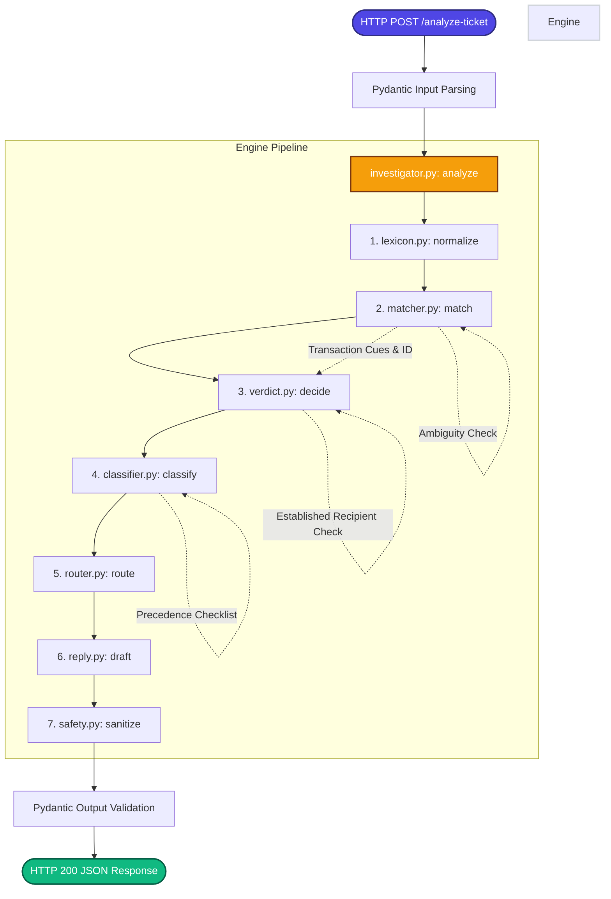

# QueueStorm Investigator: Engine Architecture

This document explains the architecture, components, and data flow of the QueueStorm Investigator reasoning engine (`app/engine/`). The system operates as a deterministic, high-throughput pipeline designed to ingest customer support tickets, analyze their transaction history, make safe routing decisions, and draft secure replies.

---

## Architecture Workflow Diagram

The diagram below details the sequence of processing from ticket ingestion to output validation and return:

---

## Detailed Component Reference

### 1. `investigator.py` (The Pipeline Orchestrator)
- **Role:** Central coordinator for the ticket processing pipeline.
- **Workflow:** 
  1. Accepts a `TicketRequest` object.
  2. Normalizes the complaint text using `lexicon.py`.
  3. Queries `matcher.py` to match the complaint with transaction history.
  4. Calls `verdict.py` to determine evidence consistency.
  5. Runs `classifier.py` to identify the complaint's case type.
  6. Evaluates routing, severity, and review flags via `router.py`.
  7. Drafts initial responses with `reply.py`.
  8. Passes all text fields through `safety.py` sanitization guardrails.
  9. Packages the verified result as a schema-compliant `TicketAnalysis` response.

### 2. `lexicon.py` (Text Normalization & Synonyms)
- **Role:** Performs pre-processing on raw string inputs (English, Bangla, mixed Banglish).
- **Core Operations:**
  - Standardizes text by converting to lowercase, stripping whitespace, and normalizing punctuation.
  - Houses dictionary mappings (`WRONG_NUMBER_CUES`, `FAILED_CUES`, `TRANSFER_CUES`, etc.) to locate semantic triggers.
  - Implements helper functions to extract specific digit chains (e.g., counterparties or amount numbers) from unstructured complaints.

### 3. `matcher.py` (Transaction Matching)
- **Role:** Finds which transaction in the history (if any) is the subject of the complaint.
- **Heuristics:**
  - Evaluates every transaction entry against key match signals: amount, type, counterparty suffix, and recency.
  - Computes a composite confidence score. If the best score exceeds the threshold, that transaction is matched.
  - **Ambiguity Guard:** If multiple high-scoring transactions have the same amount but different counterparties, the matcher flags an ambiguous match and returns `None` for the transaction ID, forcing an evaluation verdict of `insufficient_data`.

### 4. `verdict.py` (Evidence Verification)
- **Role:** Compares the details of the matched transaction (status, type, party) against the customer's claims to assign an `evidence_verdict` (`consistent`, `inconsistent`, or `insufficient_data`).
- **Core Rules:**
  - **Inconsistent:** Triggered if a customer claims a transaction failed or wasn't received, but the matched transaction status is `completed`.
  - **Established Recipient Check:** Contradicts wrong transfer claims if the customer has a history of successful, completed transfers to the exact same counterparty.
  - **Consistent:** Triggered when transaction status matches the claim (e.g., status is `failed`/`pending` and client claims failure).
  - **Insufficient Data:** Selected if no transaction matched or the history is empty.

### 5. `classifier.py` (Case Type Categorization)
- **Role:** Identifies the category of the ticket (`case_type`) using a priority-ordered checklist.
- **Precedence Order:**
  1. Phishing or Social Engineering (highest priority, checked first to isolate fraud risk).
  2. Duplicate Payment.
  3. Wrong Transfer.
  4. Payment Failed.
  5. Agent Cash-in Issue.
  6. Merchant Settlement Delay.
  7. Refund Request.
  8. Other (default).

### 6. `router.py` (Severity & Operational Routing)
- **Role:** Assigns the target operational department, severity, and human review status.
- **Business Logic:**
  - **Severity:** Assessed using case category and BDT amount thresholds. High-value transactions (>= 25,000 BDT) and Phishing escalate to `critical` or `high` severity.
  - **Department Routing:** Routes cases to specialized operations teams (e.g., `fraud_risk` for phishing, `payments_ops` for failures, `dispute_resolution` for transfers).
  - **Human Review Flag:** Explicitly flags tickets requiring human attention. Phishing, evidence contradictions (inconsistent), duplicate payments, agent issues, high-value transactions, or wrong transfers with matched evidence automatically set `human_review_required` to `true`. Routine requests and vague comments set it to `false`.

### 7. `reply.py` (Response Drafting Templates)
- **Role:** Provides template-driven text responses for `agent_summary`, `recommended_next_action`, and `customer_reply`.
- **Properties:**
  - Dynamically interpolates matching details like the `relevant_transaction_id` and amounts.
  - Generates replies that are structurally safe and professional.

### 8. `safety.py` (Fintech Safety Guardrails)
- **Role:** Non-negotiable security post-processor that enforces safety standards (S1–S4).
- **Checks and Sanitizers:**
  - **S1 (Credentials):** Scrubs any wording requesting OTP, PIN, password, or card credentials, replacing it with a secure warning.
  - **S2 (Refund Authority):** Rewrites absolute promises of reversals or refunds to safe language: *"any eligible amount will be returned through official channels"*.
  - **S3 (Suspicious Third-Parties):** Blocks references/links to unofficial domains, numbers, or communication platforms (like Telegram or WhatsApp).
  - **S4 (Prompt Injection Guard):** Sanitizes inputs to prevent system override instructions from affecting outputs.

### 9. `llm.py` (Optional LLM client wrapper)
- **Role:** Handles optional API integrations with Google Gemini.
- **Mechanism:**
  - Disabled by default. If enabled, it only serves to polish language or disambiguate complex sentences.
  - Gated behind strict timeouts and runs auxiliary to the deterministic rule engine, which acts as a fallback for reliability.
